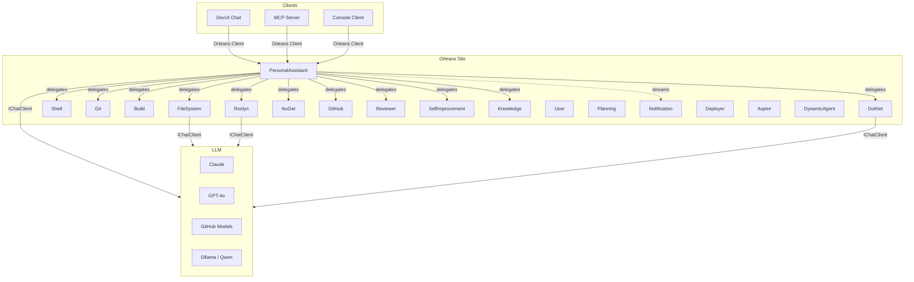

# Interactive Agents (IAW)

[](https://github.com/InteractiveAgents/IAW/actions/workflows/ci.yml)
[](LICENSE)
[](https://dotnet.microsoft.com/download/dotnet/11.0)

IAW is an Orleans-based multi-agent runtime for .NET. Build intelligent agents that collaborate, remember, and self-improve — with durable state, Orleans streaming, LLM tool calling, and .NET Aspire orchestration.

> **Status:** v0.x — usable for experimentation and prototyping. APIs may change.

## Quick Start

```bash
git clone https://github.com/InteractiveAgents/IAW.git
cd IAW
dotnet build IAW.slnx
aspire run
```

This starts the full stack: Orleans silo with 18 built-in agents, DevUI chat interface, MCP server, and Ollama.

## Create an Agent

```csharp
using Core.AI;
using Core.AI.Models;
using Core.Contracts;
using IAW.Core;
using Microsoft.Extensions.AI;
using Orleans.Journaling;

public interface IGreeterAgent : IAgent;

public class GreeterAgent(
    [Memory("agent-state")] IDurableDictionary<string, StateEntry> state,
    [Memory("agent-events")] IDurableList<AgentEvent> eventLog,
    [Llm<Sonnet46>] IChatClient chatClient,
    [Memory("history")] IDurableList<ChatMessage> history,
    [Memory("tracking")] IDurableDictionary<string, TrackingItem> trackingItems)
    : Agent(state, eventLog, chatClient, history, trackingItems), IGreeterAgent
{
    protected override string Instructions => "You are a friendly greeter.";
    protected override string DisplayName => "Greeter";
}
```

Agents are Orleans grains with durable journaled state. The `Agent` base class provides conversation, state, events, streaming, tools, and lifecycle management out of the box.

## Architecture



### Key Concepts

| Concept | Description |
|---------|-------------|
| **Agent** | Orleans `DurableGrain` with journaled state, LLM integration, and tool calling |
| **IAgent** | Flat grain interface: chat, state, events, streams, lifecycle |
| **[Memory]** | Constructor injection of durable collections (`IDurableDictionary`, `IDurableList`) |
| **[Llm\<T\>]** | Constructor injection of keyed `IChatClient` for any registered LLM model |
| **IReceiver\<T\>** | Point-to-point message passing between agents |
| **IStreamProducer/Consumer\<T\>** | Pub/sub via Orleans Streams (`"agents"` provider) |
| **Tools** | `AITool` instances discovered via `DefineTools()` override |
| **PersonalAssistant** | CEO agent that decomposes tasks and delegates to the team |

## Features

- **Durable state** — agent state, events, history, and tracking survive restarts via Orleans journaling
- **LLM integration** — `Microsoft.Extensions.AI` with streaming, tool calling, and usage tracking
- **Agent-to-agent communication** — P2P messaging (`IReceiver<T>`) and pub/sub streams (`IStreamProducer/Consumer<T>`)
- **Tool calling** — define tools as `AITool` instances; built-in file, shell, web, and workspace tools
- **Scheduling** — Orleans reminders for periodic agent tasks
- **Aspire-native** — `AddIAW()`, `WithLLM<T>()`, dashboard, health checks, OpenTelemetry
- **MCP bridge** — external orchestrators (Claude Code, etc.) control agents via MCP tools
- **DevUI** — Microsoft Agent Framework chat UI for interacting with agents
- **Self-improvement** — agents can analyze and propose improvements to their own code

## Project Structure

| Path | Description |
|------|-------------|
| `src/Core` | Agent base class, contracts, AI models, communication, tools |
| `src/Agents` | 14 built-in agents (Infrastructure, Orchestration, Review, Knowledge) |
| `src/Agents.CSharp` | 4 C# development agents (Roslyn, DotNet, NuGet, GitHub) |
| `src/IAW.AppHost` | .NET Aspire AppHost for local orchestration |
| `src/IAW.MCP` | MCP server bridge (Orleans client, HTTP transport) |
| `src/DevUI` | Microsoft Agent Framework dev UI (Orleans client) |
| `src/IAW.Testing` | Testing framework: `AgentTest<T>` + universal behavior tests |
| `src/IAW.ServiceDefaults` | Shared Aspire defaults (OpenTelemetry, health checks) |
| `samples/Samples` | Orleans silo with sample agents and HTTP endpoints |
| `samples/SimpleClient` | Minimal Orleans client — connect, chat, stream |
| `samples/Pipeline` | Event publishing and agent-to-agent event flow |
| `samples/Monitor` | Agent state, workspace, and monitoring events |
| `test/Core.Tests` | 89 unit tests + architecture guards |

## Sample Apps

After `aspire run`, run any sample in a separate terminal:

```bash
# Chat with PersonalAssistant
dotnet run --project samples/SimpleClient

# Event publishing pipeline
dotnet run --project samples/Pipeline

# State and monitoring demo
dotnet run --project samples/Monitor
```

## NuGet Packages

| Package | Purpose |
|---------|---------|
| `IAW.Core` | Agent base class, contracts, LLM integration, tools |
| `IAW.Agents` | 14 built-in agents (FileSystem, Shell, Git, PersonalAssistant, etc.) |
| `IAW.Agents.CSharp` | 4 Roslyn-powered C# agents (Roslyn, DotNet, NuGet, GitHub) |
| `IAW.Testing` | `AgentTest<T>` + universal behavior tests |

## Testing

```bash
dotnet test IAW.slnx                                            # all tests
dotnet test test/Core.Tests/IAW.Core.Tests.csproj                # unit + architecture guards
dotnet test IAW.slnx --filter "FullyQualifiedName~MethodName"    # single test
```

Inherit `AgentTest<YourAgent>` to get 18 universal behavior tests for free:

```csharp
public class GreeterAgentTests : AgentTest<GreeterAgent>;
```

## Known Limitations (v0.x)

- In-memory storage only (no persistent grain state across restarts)
- No authentication/authorization on MCP or DevUI endpoints
- Telegram bot integration is disabled pending migration
- No NuGet packages published yet — use project references
- `IBroadcaster` and `IAgentObserver` patterns cut for v0.x (use `IReceiver<T>` and streams)

## Roadmap

- [ ] Persistent grain storage (Azure, PostgreSQL)
- [ ] Authentication for MCP and DevUI
- [ ] Publish NuGet packages
- [ ] VitePress documentation site
- [ ] Telegram bot migration
- [ ] Agent marketplace / dynamic agent loading

## Contributing

Contributions are welcome! Please see [CONTRIBUTING.md](CONTRIBUTING.md) for guidelines.

## License

This project is licensed under the MIT License. See the [LICENSE](LICENSE) file for details.
