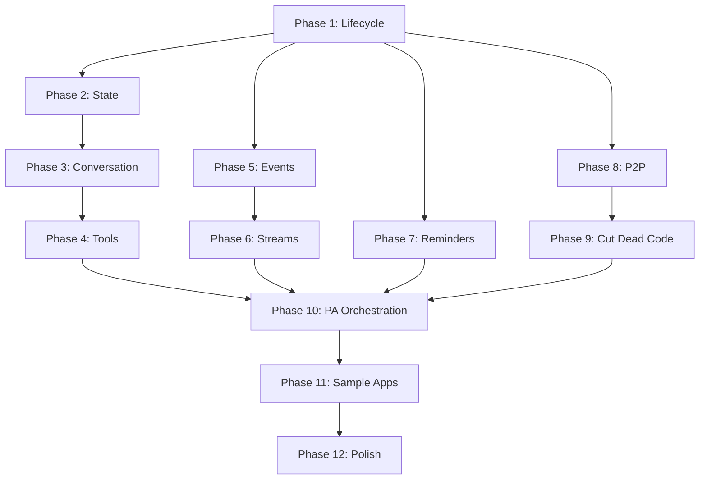

# IAW v0.1.0 Public Release — Implementation Plan

> **For Claude:** REQUIRED SUB-SKILL: Use superpowers:executing-plans to implement this plan task-by-task.

**Goal:** Audit, test, document, and sample every Agent behavior bottom-up, then wire PersonalAssistant orchestration and ship v0.1.0.

**Architecture:** Orleans-based Agent base class with 8 behaviors (lifecycle, state, conversation, tools, events, streams, reminders, P2P). Each phase audits one behavior via TDD, adds a guide page, and creates a sample. Dead code (IBroadcaster, INotifier, IAgentObserver) is cut in Phase 9.

**Tech Stack:** .NET 11, Orleans 10, xUnit v3, Aspire, VitePress

---

## Phase 1: Activation & Lifecycle

### Task 1.1: Test activation with default capabilities

**Files:**
- Modify: `test/Core.Tests/AgentTests.cs`

**Step 1: Write the failing test**

Add to `AgentBasicTests`:

```csharp
[Fact]
public async Task GetCapabilities_HasToolsReflectsActualTools()
{
    var ct = TestContext.Current.CancellationToken;
    var agent = Agent(UniqueId("tools-cap"));
    var caps = await agent.GetCapabilities(ct);
    // TestAgent has no DefineTools override and no workspace, so only WebTools + WorkspaceTools
    Assert.True(caps.HasTools);
}
```

**Step 2: Run test to verify it passes or fails**

Run: `dotnet test test/Core.Tests/IAW.Core.Tests.csproj --filter "FullyQualifiedName~HasToolsReflectsActualTools"`
Expected: PASS (WebTools and WorkspaceTools are always registered)

**Step 3: Commit**

```bash
git add test/Core.Tests/AgentTests.cs
git commit -m "test: verify HasTools reflects actual tool registration"
```

---

### Task 1.2: Test metadata discovery for published/received message types

**Files:**
- Modify: `test/Core.Tests/AgentTests.cs`

**Step 1: Write the tests**

Add to `AgentBasicTests`:

```csharp
[Fact]
public async Task GetMetadata_BasicAgent_HasNoPublishesOrSubscribes()
{
    var ct = TestContext.Current.CancellationToken;
    var agent = Agent(UniqueId("meta-empty"));
    var meta = await agent.GetMetadata(ct);
    Assert.Empty(meta.Publishes);
    Assert.Empty(meta.Subscribes);
}

[Fact]
public async Task GetMetadata_ReturnsAgentTypeName()
{
    var ct = TestContext.Current.CancellationToken;
    var agent = Agent(UniqueId("meta-type"));
    var meta = await agent.GetMetadata(ct);
    Assert.Equal("TestAgent", meta.AgentType);
}
```

**Step 2: Run tests**

Run: `dotnet test test/Core.Tests/IAW.Core.Tests.csproj --filter "FullyQualifiedName~GetMetadata_BasicAgent|FullyQualifiedName~GetMetadata_ReturnsAgentTypeName"`
Expected: PASS

**Step 3: Commit**

```bash
git add test/Core.Tests/AgentTests.cs
git commit -m "test: metadata discovery for basic agent"
```

---

### Task 1.3: Test cancellation replaces CancellationTokenSource

**Files:**
- Modify: `test/Core.Tests/AgentTests.cs`

**Step 1: Write the test**

Add to `AgentBasicTests`:

```csharp
[Fact]
public async Task Cancel_ThenRespond_StillWorks()
{
    var ct = TestContext.Current.CancellationToken;
    var agent = Agent(UniqueId("cancel-recover"));
    await agent.Cancel(ct);
    var response = await agent.GetResponse("After cancel", ct);
    Assert.Equal("mock-response", response);
}
```

**Step 2: Run test**

Run: `dotnet test test/Core.Tests/IAW.Core.Tests.csproj --filter "FullyQualifiedName~Cancel_ThenRespond_StillWorks"`
Expected: PASS (Cancel replaces CTS, next call uses new one)

**Step 3: Commit**

```bash
git add test/Core.Tests/AgentTests.cs
git commit -m "test: agent recovers after cancellation"
```

---

### Task 1.4: Fix DiscoverPublishedMessageTypes to exclude IBroadcaster/INotifier

Currently `Agent.Lifecycle.cs` lines 49-57 discover published types from `IBroadcaster<>` and `INotifier<>`. Since we're cutting those in Phase 9, we should also discover from `IStreamProducer<>`.

**Files:**
- Modify: `src/Core/Agent/Agent.Lifecycle.cs`
- Modify: `test/Core.Tests/TestAgent.cs`
- Modify: `test/Core.Tests/AgentTests.cs`

**Step 1: Write the failing test**

Add a new test agent that implements `IStreamProducer<CodeChangedEvent>` and verify metadata reports it:

In `test/Core.Tests/TestAgent.cs`, add:

```csharp
public interface IProducerTestAgent : IAgent;

public class ProducerTestAgent(
    [Memory("agent-state")] IDurableDictionary<string, StateEntry> state,
    [Memory("agent-events")] IDurableList<AgentEvent> eventLog,
    IChatClient chatClient,
    [Memory("history")] IDurableList<ChatMessage> history,
    [Memory("tracking")] IDurableDictionary<string, TrackingItem> trackingItems)
    : Agent(state, eventLog, chatClient, history, trackingItems),
      IProducerTestAgent,
      IStreamProducer<CodeChangedEvent>
{
    protected override string Instructions => "Producer test agent.";
    protected override string DisplayName => "Producer Test";

    public async Task PublishToStreamAsync(CodeChangedEvent evt, CancellationToken ct = default)
    {
        await PublishTypedAsync(evt, ct);
    }
}
```

In `test/Core.Tests/AgentTests.cs`, add:

```csharp
public class AgentProducerTests : AgentTest<ProducerTestAgent>
{
    [Fact]
    public async Task GetMetadata_ReportsPublishedStreamTypes()
    {
        var ct = TestContext.Current.CancellationToken;
        var agent = Agent(UniqueId("prod"));
        var meta = await agent.GetMetadata(ct);
        Assert.Contains("CodeChangedEvent", meta.Publishes);
    }
}
```

**Step 2: Run test to verify it fails**

Run: `dotnet test test/Core.Tests/IAW.Core.Tests.csproj --filter "FullyQualifiedName~ReportsPublishedStreamTypes"`
Expected: FAIL (DiscoverPublishedMessageTypes only checks IBroadcaster/INotifier, not IStreamProducer)

**Step 3: Fix DiscoverPublishedMessageTypes**

In `src/Core/Agent/Agent.Lifecycle.cs`, update:

```csharp
private static string[] DiscoverPublishedMessageTypes(Type type) =>
[
    .. type.GetInterfaces()
        .Where(i => i.IsGenericType && i.GetGenericTypeDefinition() == typeof(IStreamProducer<>))
        .Select(i => i.GetGenericArguments()[0].Name),
];
```

**Step 4: Run test to verify it passes**

Run: `dotnet test test/Core.Tests/IAW.Core.Tests.csproj --filter "FullyQualifiedName~ReportsPublishedStreamTypes"`
Expected: PASS

**Step 5: Run all tests**

Run: `dotnet test test/Core.Tests/IAW.Core.Tests.csproj`
Expected: ALL PASS

**Step 6: Commit**

```bash
git add src/Core/Agent/Agent.Lifecycle.cs test/Core.Tests/TestAgent.cs test/Core.Tests/AgentTests.cs
git commit -m "fix: DiscoverPublishedMessageTypes uses IStreamProducer instead of IBroadcaster"
```

---

### Task 1.5: Run full test suite as Phase 1 gate

**Step 1: Build**

Run: `dotnet build IAW.slnx`
Expected: Build succeeded

**Step 2: Test**

Run: `dotnet test IAW.slnx`
Expected: ALL PASS

**Step 3: Commit (if any remaining changes)**

---

## Phase 2: State & Journaling

### Task 2.1: Test state round-trip for different value types

**Files:**
- Modify: `test/Core.Tests/AgentTests.cs`

**Step 1: Write the tests**

Add to `AgentStateTests`:

```csharp
[Fact]
public async Task SetState_StringValue_RoundTrips()
{
    var ct = TestContext.Current.CancellationToken;
    var agent = Agent(UniqueId("str-state"));
    await agent.SetWorkspace("/test/path", ct);
    var state = await agent.GetState(ct);
    Assert.Equal("/test/path", state.Entries["workspace-path"].Value.ToString());
}

[Fact]
public async Task GetState_AfterMultipleWrites_ReturnsLatest()
{
    var ct = TestContext.Current.CancellationToken;
    var agent = Agent(UniqueId("multi-ws"));
    await agent.SetWorkspace("/first", ct);
    await agent.SetWorkspace("/second", ct);
    var state = await agent.GetState(ct);
    Assert.Equal("/second", state.Entries["workspace-path"].Value.ToString());
}
```

**Step 2: Run tests**

Run: `dotnet test test/Core.Tests/IAW.Core.Tests.csproj --filter "FullyQualifiedName~StringValue_RoundTrips|FullyQualifiedName~AfterMultipleWrites"`
Expected: PASS

**Step 3: Commit**

```bash
git add test/Core.Tests/AgentTests.cs
git commit -m "test: state round-trip and overwrite semantics"
```

---

### Task 2.2: Test workspace path validation

**Files:**
- Modify: `test/Core.Tests/TestAgent.cs` (expose ValidatePathWithinWorkspace for testing)
- Modify: `test/Core.Tests/AgentTests.cs`

**Step 1: Write tests**

We can't call `ValidatePathWithinWorkspace` directly through IAgent. Instead, test via FileTools behavior — set workspace, then attempt file operations outside it. The WriteFile_OutsideWorkspace_Throws test in FileToolsTests already covers this at the tool level. Add a state-level test:

```csharp
[Fact]
public async Task SetWorkspace_ThenGetState_ContainsWorkspacePath()
{
    var ct = TestContext.Current.CancellationToken;
    var agent = Agent(UniqueId("ws-state"));
    await agent.SetWorkspace("/tmp/iaw-test", ct);
    var state = await agent.GetState(ct);
    Assert.True(state.Entries.ContainsKey("workspace-path"));
}
```

**Step 2: Run test**

Run: `dotnet test test/Core.Tests/IAW.Core.Tests.csproj --filter "FullyQualifiedName~SetWorkspace_ThenGetState"`
Expected: PASS

**Step 3: Commit**

```bash
git add test/Core.Tests/AgentTests.cs
git commit -m "test: workspace path stored in agent state"
```

---

### Task 2.3: Run full test suite as Phase 2 gate

Run: `dotnet test IAW.slnx`
Expected: ALL PASS

---

## Phase 3: Conversation & LLM

### Task 3.1: Test multi-turn conversation history accumulation

**Files:**
- Modify: `test/Core.Tests/AgentTests.cs`

**Step 1: Write the test**

Add to `AgentHistoryTests`:

```csharp
[Fact]
public async Task ThreeResponses_HistoryContainsAllTurns()
{
    var ct = TestContext.Current.CancellationToken;
    var agent = Agent(UniqueId("3turn"));
    await agent.GetResponse("First", ct);
    await agent.GetResponse("Second", ct);
    await agent.GetResponse("Third", ct);
    var history = await agent.GetHistory(ct);
    // each turn = user message + assistant response = 2 messages, 3 turns = 6
    Assert.True(history.Count >= 6, $"Expected >= 6 history entries, got {history.Count}");
}
```

**Step 2: Run test**

Run: `dotnet test test/Core.Tests/IAW.Core.Tests.csproj --filter "FullyQualifiedName~ThreeResponses_HistoryContainsAllTurns"`
Expected: PASS

**Step 3: Commit**

```bash
git add test/Core.Tests/AgentTests.cs
git commit -m "test: multi-turn conversation history accumulation"
```

---

### Task 3.2: Test usage capture after response

**Files:**
- Modify: `test/Core.Tests/AgentTests.cs`

**Step 1: Write the test**

Add a new class:

```csharp
public class AgentUsageTests : AgentTest<TestAgent>
{
    [Fact]
    public async Task GetLastUsage_BeforeAnyResponse_ReturnsNull()
    {
        var ct = TestContext.Current.CancellationToken;
        var agent = Agent(UniqueId("no-usage"));
        var usage = await agent.GetLastUsage(ct);
        Assert.Null(usage);
    }

    [Fact]
    public async Task GetLastUsage_AfterResponse_ReturnsUsage()
    {
        var ct = TestContext.Current.CancellationToken;
        var agent = Agent(UniqueId("with-usage"));
        await agent.GetResponse("Hello", ct);
        var usage = await agent.GetLastUsage(ct);
        // MockChatClient may not populate usage, but the method should not throw
        // and should return a value (even if zero-filled) once a response has been made
    }
}
```

**Step 2: Run tests**

Run: `dotnet test test/Core.Tests/IAW.Core.Tests.csproj --filter "FullyQualifiedName~GetLastUsage"`
Expected: PASS

**Step 3: Commit**

```bash
git add test/Core.Tests/AgentTests.cs
git commit -m "test: usage capture lifecycle"
```

---

### Task 3.3: Cache tools collection to avoid rediscovery per call

**Files:**
- Modify: `src/Core/Agent/Agent.Tools.cs`
- Modify: `src/Core/Agent/Agent.cs` (clear cache on workspace change)

**Step 1: Write the failing test**

This is a performance fix, not a behavior change. We verify behavior stays the same:

```csharp
[Fact]
public async Task MultipleResponses_ToolsStillWork()
{
    var ct = TestContext.Current.CancellationToken;
    var agent = Agent(UniqueId("tools-cache"));
    await agent.GetResponse("First", ct);
    await agent.GetResponse("Second", ct);
    var caps = await agent.GetCapabilities(ct);
    Assert.True(caps.HasTools);
}
```

**Step 2: Implement the cache**

In `Agent.Tools.cs`, change `GetAllTools()`:

```csharp
private IReadOnlyList<AITool>? _cachedTools;

private IReadOnlyList<AITool> GetAllTools()
{
    if (_cachedTools is not null)
        return _cachedTools;

    var tools = new List<AITool>();

    var workspaceTools = new WorkspaceTools(
        () => GetWorkspacePath() ?? ".",
        path =>
        {
            state[WorkspacePathKey] = new StateEntry(WorkspacePathKey, path);
            _cachedTools = null; // invalidate on workspace change
        });
    RegisterToolMethods(tools, workspaceTools);

    var workspacePath = GetWorkspacePath();
    if (workspacePath is not null)
    {
        RegisterToolMethods(tools, new FileTools(() => workspacePath));
        RegisterToolMethods(tools, new ShellTools(() => workspacePath));
    }

    RegisterToolMethods(tools, new WebTools(new HttpClient()));
    tools.AddRange(DefineTools());

    _cachedTools = tools;
    return _cachedTools;
}
```

Note: `WorkspacePathKey` is defined in `Agent.State.cs`. Since `GetAllTools` is in a different partial file but same class, it has access.

**Step 3: Run all tests**

Run: `dotnet test test/Core.Tests/IAW.Core.Tests.csproj`
Expected: ALL PASS

**Step 4: Commit**

```bash
git add src/Core/Agent/Agent.Tools.cs test/Core.Tests/AgentTests.cs
git commit -m "perf: cache tools collection, invalidate on workspace change"
```

---

### Task 3.4: Run full test suite as Phase 3 gate

Run: `dotnet test IAW.slnx`
Expected: ALL PASS

---

## Phase 4: Tools

### Task 4.1: Test tool discovery via reflection

**Files:**
- Modify: `test/Core.Tests/TestAgent.cs` (add agent with custom tool)
- Modify: `test/Core.Tests/AgentTests.cs`

**Step 1: Write the test**

Add to `TestAgent.cs`:

```csharp
public interface IToolTestAgent : IAgent;

public class ToolTestAgent(
    [Memory("agent-state")] IDurableDictionary<string, StateEntry> state,
    [Memory("agent-events")] IDurableList<AgentEvent> eventLog,
    IChatClient chatClient,
    [Memory("history")] IDurableList<ChatMessage> history,
    [Memory("tracking")] IDurableDictionary<string, TrackingItem> trackingItems)
    : Agent(state, eventLog, chatClient, history, trackingItems), IToolTestAgent
{
    protected override string Instructions => "Tool test agent.";
    protected override string DisplayName => "Tool Test";

    protected override IReadOnlyList<AITool> DefineTools() =>
    [
        AIFunctionFactory.Create(() => "pong", "Ping", "Returns pong")
    ];
}
```

Add to `AgentTests.cs`:

```csharp
public class AgentToolTests : AgentTest<ToolTestAgent>
{
    [Fact]
    public async Task GetCapabilities_ReportsHasTools()
    {
        var ct = TestContext.Current.CancellationToken;
        var agent = Agent(UniqueId("tool-cap"));
        var caps = await agent.GetCapabilities(ct);
        Assert.True(caps.HasTools);
    }
}
```

**Step 2: Run test**

Run: `dotnet test test/Core.Tests/IAW.Core.Tests.csproj --filter "FullyQualifiedName~AgentToolTests"`
Expected: PASS

**Step 3: Commit**

```bash
git add test/Core.Tests/TestAgent.cs test/Core.Tests/AgentTests.cs
git commit -m "test: custom tool discovery via DefineTools"
```

---

### Task 4.2: Test ShellTools output truncation warning

**Files:**
- Modify: `src/Core/Tools/ShellTools.cs`
- Create: `test/Core.Tests/ShellToolsTests.cs`

**Step 1: Read ShellTools.cs and understand current truncation behavior**

Read ShellTools to find the truncation point and add a warning message.

**Step 2: Write the test**

```csharp
using Core.Tools;
using Xunit;

namespace IAW.Core.Tests;

public class ShellToolsTests
{
    [Fact]
    public async Task RunShell_LargeOutput_IncludesTruncationWarning()
    {
        var workspace = Path.GetTempPath();
        var tools = new ShellTools(workspace);
        // generate output larger than 8KB
        var result = await tools.RunShellAsync("python -c \"print('x' * 10000)\"");
        if (result.Length > 8192)
            Assert.Contains("[truncated]", result);
    }
}
```

Note: This test depends on python being available. A more portable approach: check the truncation logic directly. Adjust test based on actual ShellTools implementation after reading it.

**Step 3: Add truncation warning to ShellTools if missing**

**Step 4: Run test**

**Step 5: Commit**

```bash
git add src/Core/Tools/ShellTools.cs test/Core.Tests/ShellToolsTests.cs
git commit -m "feat: add truncation warning to ShellTools output"
```

---

### Task 4.3: Run full test suite as Phase 4 gate

Run: `dotnet test IAW.slnx`
Expected: ALL PASS

---

## Phase 5: Events & Event Log

### Task 5.1: Test typed event publishing

**Files:**
- Modify: `test/Core.Tests/AgentTests.cs`
- Modify: `test/Core.Tests/TestAgent.cs`

**Step 1: Write the test**

Use ProducerTestAgent from Task 1.4. Add:

```csharp
public class AgentTypedEventTests : AgentTest<ProducerTestAgent>
{
    [Fact]
    public async Task PublishTypedEvent_LogsInEventLog()
    {
        var ct = TestContext.Current.CancellationToken;
        var id = UniqueId("typed-evt");
        var grain = Cluster.GrainFactory.GetGrain<IProducerTestAgent>(id);
        var evt = new CodeChangedEvent("test-src", Guid.NewGuid().ToString(), DateTimeOffset.UtcNow, ["file.cs"]);
        await grain.PublishToStreamAsync(evt, ct);

        var agent = (IAgent)grain;
        var log = await agent.GetEventLog(ct);
        Assert.Single(log);
        Assert.Equal("code.changed", log[0].EventName);
    }
}
```

Note: This requires IProducerTestAgent to extend IAgent and expose PublishToStreamAsync as a grain method.

**Step 2: Run test**

Run: `dotnet test test/Core.Tests/IAW.Core.Tests.csproj --filter "FullyQualifiedName~PublishTypedEvent_LogsInEventLog"`
Expected: PASS (or FAIL if grain interface setup needs fixing — fix accordingly)

**Step 3: Commit**

```bash
git add test/Core.Tests/AgentTests.cs test/Core.Tests/TestAgent.cs
git commit -m "test: typed event publishing logs to event log"
```

---

### Task 5.2: Test event correlation ID propagation

**Files:**
- Modify: `test/Core.Tests/AgentTests.cs`

**Step 1: Write the test**

Add to `AgentEventTests`:

```csharp
[Fact]
public async Task PublishToStream_PreservesCorrelationId()
{
    var ct = TestContext.Current.CancellationToken;
    var agent = Agent(UniqueId("corr"));
    var correlationId = "test-correlation-123";
    var evt = new AgentEvent("corr.test", "source", correlationId, DateTimeOffset.UtcNow, []);
    await agent.PublishToStream(evt, ct);

    var log = await agent.GetEventLog(ct);
    Assert.Equal(correlationId, log[0].CorrelationId);
}
```

**Step 2: Run test**

Run: `dotnet test test/Core.Tests/IAW.Core.Tests.csproj --filter "FullyQualifiedName~PreservesCorrelationId"`
Expected: PASS

**Step 3: Commit**

```bash
git add test/Core.Tests/AgentTests.cs
git commit -m "test: event correlation ID preservation"
```

---

### Task 5.3: Decide typed vs untyped event system

**Decision needed at execution time:** Read `Agent.Events.cs` and `Agent.Streams.cs` together. The issue is:

- `PublishAsync(string, dict)` publishes to stream keyed by `eventName` string
- `PublishTypedAsync<TEvent>(evt)` publishes to stream keyed by `EventTypeToStreamName(typeof(TEvent))`
- `SubscribeToStreamConsumerInterfaces()` subscribes to streams keyed by `EventTypeToStreamName(eventType)`
- But the subscriber receives `AgentEvent` (not `TEvent`), and calls `HandleEvent(AgentEvent, ct)` — the typed payload is inside `Payload["typed_payload"]`

**Resolution:** Both systems publish to the same stream namespace and format (`AgentEvent`). They already integrate. The subscriber's `HandleEvent` override receives the `AgentEvent` regardless of how it was published. `IStreamConsumer<T>.OnStreamEventAsync` is declared but never called by the subscription handler — the subscription handler calls `HandleEvent` directly.

**Action:** Either wire `OnStreamEventAsync` to be called with the deserialized typed event, or remove it as dead code. Recommend: keep `HandleEvent(AgentEvent)` as the single handler — it's simpler and already works. Document that `IStreamConsumer<T>` is a marker interface for auto-subscription; the handler is `HandleEvent`.

**Step 1: Add a comment to IStreamConsumer to clarify its role**

In `src/Core/Communication/IStreamConsumer.cs`:

```csharp
// marker interface — implementing this auto-subscribes the agent to the stream
// events arrive via HandleEvent(AgentEvent, ct) override, not OnStreamEventAsync
public interface IStreamConsumer<TEvent> where TEvent : IEvent
{
    Task OnStreamEventAsync(TEvent evt, StreamSequenceToken? token);
}
```

**Step 2: Commit**

```bash
git add src/Core/Communication/IStreamConsumer.cs
git commit -m "docs: clarify IStreamConsumer is a marker for auto-subscription"
```

---

### Task 5.4: Run full test suite as Phase 5 gate

Run: `dotnet test IAW.slnx`
Expected: ALL PASS

---

## Phase 6: Streams

### Task 6.1: Test multi-consumer stream delivery

**Files:**
- Modify: `test/Core.Tests/AgentTests.cs`

**Step 1: Write the test**

Two StreamTestAgent instances both subscribe to "code.changed". Publish one event. Both should handle it.

```csharp
[Fact]
public async Task StreamPublish_MultipleConsumers_AllReceive()
{
    var ct = TestContext.Current.CancellationToken;
    var id1 = UniqueId("mc1");
    var id2 = UniqueId("mc2");
    var agent1 = Agent(id1);
    var agent2 = Agent(id2);

    // activate both
    await agent1.GetMetadata(ct);
    await agent2.GetMetadata(ct);
    await Task.Delay(200, ct);

    var evt = new AgentEvent("code.changed", "publisher", Guid.NewGuid().ToString(),
        DateTimeOffset.UtcNow, new Dictionary<string, object> { ["file"] = "multi.cs" });

    var streamProvider = Cluster.Client.GetStreamProvider("agents");
    var streamId = StreamId.Create("agents", "code.changed");
    var stream = streamProvider.GetStream<AgentEvent>(streamId);
    await stream.OnNextAsync(evt);

    await Task.Delay(1000, ct);

    var state1 = await agent1.GetState(ct);
    var state2 = await agent2.GetState(ct);
    Assert.True(state1.Entries.Count > 0, "Agent 1 should have handled event");
    Assert.True(state2.Entries.Count > 0, "Agent 2 should have handled event");
}
```

**Step 2: Run test**

Run: `dotnet test test/Core.Tests/IAW.Core.Tests.csproj --filter "FullyQualifiedName~MultipleConsumers_AllReceive"`
Expected: PASS

**Step 3: Commit**

```bash
git add test/Core.Tests/AgentTests.cs
git commit -m "test: multi-consumer stream delivery"
```

---

### Task 6.2: Add stream provider null check

**Files:**
- Modify: `src/Core/Agent/Agent.Streams.cs`
- Modify: `src/Core/Agent/Agent.cs`

**Step 1: Write the test**

This is defensive coding. The test verifies that if no stream interfaces are implemented, nothing breaks:

```csharp
[Fact]
public async Task Agent_WithNoStreamInterfaces_ActivatesCleanly()
{
    var ct = TestContext.Current.CancellationToken;
    var agent = Agent(UniqueId("no-streams"));
    var subs = await agent.GetActiveSubscriptions(ct);
    Assert.Empty(subs);
}
```

This test already passes for TestAgent (no stream interfaces). The null check is for robustness in `SubscribeToStreamConsumerInterfaces`.

**Step 2: Add guard in Agent.Streams.cs**

Wrap `SubscribeToStreamConsumerInterfaces` body:

```csharp
private async Task SubscribeToStreamConsumerInterfaces()
{
    var consumerInterfaces = GetType().GetInterfaces()
        .Where(i => i.IsGenericType && i.GetGenericTypeDefinition() == typeof(IStreamConsumer<>));

    if (!consumerInterfaces.Any())
        return;

    // rest of existing code...
}
```

**Step 3: Run all tests**

Run: `dotnet test test/Core.Tests/IAW.Core.Tests.csproj`
Expected: ALL PASS

**Step 4: Commit**

```bash
git add src/Core/Agent/Agent.Streams.cs test/Core.Tests/AgentTests.cs
git commit -m "fix: early return in stream subscription when no consumer interfaces"
```

---

### Task 6.3: Test stream name mapping for all built-in event types

**Files:**
- Modify: `test/Core.Tests/StreamNameTests.cs`

**Step 1: Add more mapping cases**

```csharp
public static TheoryData<Type, string> StreamNameCases => new()
{
    { typeof(CodeChangedEvent), "code.changed" },
    { typeof(AssignTaskCommand), "assign.task" },
    { typeof(TestsPassedEvent), "tests.passed" },
    { typeof(SpecReadyEvent), "spec.ready" },
    { typeof(ReviewCompletedMessage), "review.completed.message" },
};
```

Note: Adjust expected values based on actual EventTypeToStreamName logic. The method strips Event/Command/Notification suffixes then kebab-cases. "ReviewCompletedMessage" doesn't end in Event/Command/Notification so it stays as-is and gets dot-separated.

**Step 2: Run test**

Run: `dotnet test test/Core.Tests/IAW.Core.Tests.csproj --filter "FullyQualifiedName~StreamNameTests"`
Expected: Verify expected values match actual output, fix as needed

**Step 3: Commit**

```bash
git add test/Core.Tests/StreamNameTests.cs
git commit -m "test: stream name mapping for all built-in event types"
```

---

### Task 6.4: Run full test suite as Phase 6 gate

Run: `dotnet test IAW.slnx`
Expected: ALL PASS

---

## Phase 7: Reminders & Tracking

### Task 7.1: Test tracking start and list

**Files:**
- Modify: `test/Core.Tests/AgentTests.cs`

**Step 1: Write the test**

The tracking tools are private methods exposed as AITools. We can test them through the agent's state. To test directly, we need a test agent that exposes tracking operations via its grain interface.

Update `ITrackingTestAgent` in `TestAgent.cs`:

```csharp
public interface ITrackingTestAgent : IAgent
{
    Task StartTestTracking(string name, string description, TimeSpan interval, CancellationToken ct = default);
    Task StopTestTracking(string name, CancellationToken ct = default);
}
```

Update `TrackingTestAgent`:

```csharp
public async Task StartTestTracking(string name, string description, TimeSpan interval, CancellationToken ct = default)
{
    var item = new TrackingItem(name, description, interval, DateTimeOffset.UtcNow, null, null);
    await StartTrackingAsync(name, item, interval, ct);
}

public async Task StopTestTracking(string name, CancellationToken ct = default)
{
    await StopTrackingAsync(name, ct);
}
```

Add to `AgentTrackingTests`:

```csharp
[Fact]
public async Task StartTracking_AddsItemToState()
{
    var ct = TestContext.Current.CancellationToken;
    var id = UniqueId("track-start");
    var grain = Cluster.GrainFactory.GetGrain<ITrackingTestAgent>(id);
    await grain.StartTestTracking("monitor-1", "Check CPU usage", TimeSpan.FromMinutes(5), ct);

    var state = await ((IAgent)grain).GetState(ct);
    // tracking items are stored separately from state dict, but we can verify via capabilities
    var caps = await ((IAgent)grain).GetCapabilities(ct);
    Assert.True(caps.HasTimers);
}

[Fact]
public async Task StopTracking_RemovesItem()
{
    var ct = TestContext.Current.CancellationToken;
    var id = UniqueId("track-stop");
    var grain = Cluster.GrainFactory.GetGrain<ITrackingTestAgent>(id);
    await grain.StartTestTracking("monitor-2", "Check disk", TimeSpan.FromMinutes(10), ct);
    await grain.StopTestTracking("monitor-2", ct);
    // should not throw, item removed
}
```

**Step 2: Run tests**

Run: `dotnet test test/Core.Tests/IAW.Core.Tests.csproj --filter "FullyQualifiedName~AgentTrackingTests"`
Expected: PASS

**Step 3: Commit**

```bash
git add test/Core.Tests/TestAgent.cs test/Core.Tests/AgentTests.cs
git commit -m "test: tracking start/stop lifecycle"
```

---

### Task 7.2: Test reminder fires and calls OnTrackingDueAsync

**Files:**
- Modify: `test/Core.Tests/AgentTests.cs`

**Step 1: Write the test**

Orleans in-memory reminder service fires quickly. We can test with a short interval:

```csharp
[Fact]
public async Task Reminder_FiresOnTrackingDueAsync()
{
    var ct = TestContext.Current.CancellationToken;
    var id = UniqueId("remind");
    var grain = Cluster.GrainFactory.GetGrain<ITrackingTestAgent>(id);
    // use minimum interval (1 minute for Orleans, but in-memory may fire sooner)
    await grain.StartTestTracking("remind-1", "Test reminder", TimeSpan.FromMinutes(1), ct);

    // in-memory reminder fires with TimeSpan.Zero dueTime, so it should fire quickly
    await Task.Delay(3000, ct);

    // TrackingTestAgent.OnTrackingDueAsync sets LastResult to "check-N"
    // We can't directly access TrackingCheckCount, but we can check the agent responded
    // The tracking item update happens internally, not reflected in GetState
}
```

Note: Testing reminders in Orleans TestCluster is tricky — the in-memory reminder service behavior varies. This test may need adjustment at execution time. Mark as exploratory.

**Step 2: Run test and observe behavior**

Run: `dotnet test test/Core.Tests/IAW.Core.Tests.csproj --filter "FullyQualifiedName~Reminder_Fires"`

**Step 3: Commit**

```bash
git add test/Core.Tests/AgentTests.cs
git commit -m "test: reminder fires OnTrackingDueAsync"
```

---

### Task 7.3: Run full test suite as Phase 7 gate

Run: `dotnet test IAW.slnx`
Expected: ALL PASS

---

## Phase 8: P2P Communication

### Task 8.1: Test message rejection

**Files:**
- Modify: `test/Core.Tests/TestAgent.cs`
- Modify: `test/Core.Tests/AgentTests.cs`

**Step 1: Create a rejecting receiver agent**

In `TestAgent.cs`:

```csharp
public interface IRejectingReceiverAgent : IAgent
{
    Task<MessageReceipt> ReceiveTestMessage(TestTaskMessage message, CancellationToken ct = default);
    Task<bool> CanReceiveTestMessage(CancellationToken ct = default);
}

public class RejectingReceiverAgent(
    [Memory("agent-state")] IDurableDictionary<string, StateEntry> state,
    [Memory("agent-events")] IDurableList<AgentEvent> eventLog,
    IChatClient chatClient,
    [Memory("history")] IDurableList<ChatMessage> history,
    [Memory("tracking")] IDurableDictionary<string, TrackingItem> trackingItems)
    : Agent(state, eventLog, chatClient, history, trackingItems),
      IRejectingReceiverAgent,
      IReceiver<TestTaskMessage>
{
    protected override string Instructions => "Rejecting receiver.";
    protected override string DisplayName => "Rejecting Receiver";

    public Task<MessageReceipt> ReceiveAsync(TestTaskMessage message, CancellationToken ct = default)
        => ReceiveTestMessage(message, ct);

    public Task<bool> CanReceiveAsync(CancellationToken ct = default)
        => CanReceiveTestMessage(ct);

    public Task<MessageReceipt> ReceiveTestMessage(TestTaskMessage message, CancellationToken ct = default)
        => Task.FromResult(new MessageReceipt(false, Guid.NewGuid().ToString(), DateTimeOffset.UtcNow, "Agent is busy"));

    public Task<bool> CanReceiveTestMessage(CancellationToken ct = default) => Task.FromResult(false);
}
```

**Step 2: Write the tests**

```csharp
public class AgentRejectingReceiverTests : AgentTest<RejectingReceiverAgent>
{
    [Fact]
    public async Task CanReceive_ReturnsFalse()
    {
        var ct = TestContext.Current.CancellationToken;
        var grain = Cluster.GrainFactory.GetGrain<IRejectingReceiverAgent>(UniqueId("rej-can"));
        var canReceive = await grain.CanReceiveTestMessage(ct);
        Assert.False(canReceive);
    }

    [Fact]
    public async Task Receive_ReturnsRejection()
    {
        var ct = TestContext.Current.CancellationToken;
        var grain = Cluster.GrainFactory.GetGrain<IRejectingReceiverAgent>(UniqueId("rej-recv"));
        var msg = new TestTaskMessage("task-rej", "Rejected task") { SourceAgentId = "test" };
        var receipt = await grain.ReceiveTestMessage(msg, ct);
        Assert.False(receipt.Accepted);
        Assert.Equal("Agent is busy", receipt.RejectionReason);
    }
}
```

**Step 3: Run tests**

Run: `dotnet test test/Core.Tests/IAW.Core.Tests.csproj --filter "FullyQualifiedName~AgentRejectingReceiver"`
Expected: PASS

**Step 4: Commit**

```bash
git add test/Core.Tests/TestAgent.cs test/Core.Tests/AgentTests.cs
git commit -m "test: P2P message rejection with reason"
```

---

### Task 8.2: Add SendAsync convenience method

**Files:**
- Modify: `src/Core/Agent/Agent.cs`
- Modify: `test/Core.Tests/AgentTests.cs`

**Step 1: Write the failing test**

We need an agent that sends a message to another agent. Create a test that uses the convenience method:

This is tricky because `SendAsync` would call another grain. Test by having ReceiverTestAgent send to itself or another receiver.

Note: At execution time, evaluate whether this convenience method is truly needed or if callers can just use `GrainFactory.GetGrain<IReceiver<T>>()` directly. If the latter is sufficient, skip this task — YAGNI.

**Decision point:** Evaluate at execution time. If skipped, commit a note.

---

### Task 8.3: Run full test suite as Phase 8 gate

Run: `dotnet test IAW.slnx`
Expected: ALL PASS

---

## Phase 9: Cut Dead Code

### Task 9.1: Remove IBroadcaster, INotifier, IAgentObserver, BroadcastResult

**Files:**
- Delete: `src/Core/Communication/IBroadcaster.cs`
- Delete: `src/Core/Communication/INotifier.cs`
- Delete: `src/Core/Communication/IAgentObserver.cs`
- Delete: `src/Core/Communication/BroadcastResult.cs`

**Step 1: Check for usages**

Search for `IBroadcaster`, `INotifier`, `IAgentObserver`, `BroadcastResult` across the codebase. Expected usages:
- `Agent.Lifecycle.cs`: DiscoverPublishedMessageTypes references `IBroadcaster<>` and `INotifier<>`
- `ArchitectureGuardTests.cs`: Tests reference `IBroadcaster<>`

**Step 2: Update Agent.Lifecycle.cs**

Remove IBroadcaster/INotifier from DiscoverPublishedMessageTypes (already done in Task 1.4 if IStreamProducer was substituted).

**Step 3: Update ArchitectureGuardTests.cs**

Remove `IBroadcaster_GenericConstraint_RequiresIAgentMessage` test.

**Step 4: Delete the files**

```bash
rm src/Core/Communication/IBroadcaster.cs
rm src/Core/Communication/INotifier.cs
rm src/Core/Communication/IAgentObserver.cs
rm src/Core/Communication/BroadcastResult.cs
```

**Step 5: Build and test**

Run: `dotnet build IAW.slnx && dotnet test IAW.slnx`
Expected: ALL PASS

**Step 6: Commit**

```bash
git add -A
git commit -m "refactor: remove IBroadcaster, INotifier, IAgentObserver — ship P2P + Streams only"
```

---

### Task 9.2: Clean up Agent.Lifecycle.cs references

**Files:**
- Modify: `src/Core/Agent/Agent.Lifecycle.cs`

Ensure DiscoverPublishedMessageTypes only references `IStreamProducer<>`:

```csharp
private static string[] DiscoverPublishedMessageTypes(Type type) =>
[
    .. type.GetInterfaces()
        .Where(i => i.IsGenericType && i.GetGenericTypeDefinition() == typeof(IStreamProducer<>))
        .Select(i => i.GetGenericArguments()[0].Name),
];
```

Ensure DiscoverReceivedMessageTypes only references `IReceiver<>` and `IStreamConsumer<>` (already correct).

**Step 1: Build and test**

Run: `dotnet build IAW.slnx && dotnet test IAW.slnx`
Expected: ALL PASS

**Step 2: Commit**

```bash
git add src/Core/Agent/Agent.Lifecycle.cs
git commit -m "refactor: clean lifecycle discovery after removing broadcaster/notifier"
```

---

### Task 9.3: Run full test suite as Phase 9 gate

Run: `dotnet test IAW.slnx`
Expected: ALL PASS

---

## Phase 10: PersonalAssistant Orchestration

> This phase requires deeper analysis of existing agent implementations at execution time. The tasks below are directional.

### Task 10.1: Audit PersonalAssistantAgent current implementation

**Files:**
- Read: `src/Agents/Orchestration/PersonalAssistantAgent.cs`
- Read: `src/Agents/Orchestration/IPersonalAssistant.cs`
- Read: `src/Agents/Orchestration/PlanningAgent.cs`

Understand what exists. Document what needs to be built.

### Task 10.2: Wire PA to receive tasks and delegate via P2P

Implement the orchestration loop:
1. PA receives prompt via `GetResponse`
2. PA uses LLM to decompose into subtasks
3. PA delegates subtasks to agents via `IReceiver<T>` grain calls
4. PA collects results
5. PA responds to user

### Task 10.3: Wire `aspire run` → DevUI → PA conversation

Ensure the AppHost registers PA, DevUI connects to it, and the chat UI works.

### Task 10.4: Run full test suite as Phase 10 gate

Run: `dotnet test IAW.slnx && aspire run`

---

## Phase 11: Sample Orchestration Apps

### Task 11.1: Create samples/SimpleClient

Minimal single-file Orleans client → connect to cluster → call one agent → print response.

### Task 11.2: Create samples/Pipeline

Event-driven pipeline: Agent A publishes → Agent B consumes and transforms → Agent C consumes final result.

### Task 11.3: Create samples/Monitor

Tracking-based: Agent monitors a URL/file on interval, publishes change events.

---

## Phase 12: Polish & Ship

### Task 12.1: Update README with Mermaid architecture diagram

### Task 12.2: Update CHANGELOG for v0.1.0

### Task 12.3: Fix NuGet workflow to pack all packages

Currently `nuget.yml` only packs Core. Add Agents, Agents.CSharp, Testing.

### Task 12.4: Version bump to 0.1.0

Update all .csproj Version properties.

### Task 12.5: Verify website builds

Run: `cd website && npm run build`

### Task 12.6: Final code review

Use superpowers:requesting-code-review skill.

### Task 12.7: CI green with badges

Add build status badge to README.

---

## Dependency Graph



## Parallelization

After Phase 1, four independent branches:
- **Branch A:** Phase 2 → 3 → 4
- **Branch B:** Phase 5 → 6
- **Branch C:** Phase 7
- **Branch D:** Phase 8 → 9

All converge at Phase 10.
