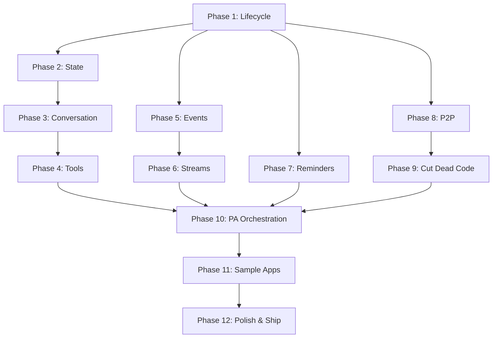

# IAW v0.1.0 Public Release Design

**Date:** 2026-03-08
**Status:** Approved
**Approach:** Bottom-up (framework first)
**Versioning:** v0.x open source — no stability promises

## Decisions

- **Audience:** All (.NET devs, AI practitioners, platform engineers)
- **Golden path:** `git clone` → `aspire run` → chat with PersonalAssistant
- **Communication patterns shipped:** P2P (IReceiver) + Streams (IStreamProducer/Consumer)
- **Cut for v0.x:** IBroadcaster, INotifier, IAgentObserver — additive, can return in v0.2+
- **Diagrams:** Mermaid in markdown (GitHub-native rendering)

## Phase 1 — Activation & Lifecycle

**Audit:** Grain activation, metadata discovery, capabilities detection, cancellation.

**Work:**
- Verify all existing lifecycle tests pass
- Add tests: activation with missing LLM, activation with no tools, capabilities reflect actual interfaces
- Fix any bugs found
- Document: website guide page on agent lifecycle

**Sample:** `samples/Lifecycle/` — single-file client that activates an agent, reads metadata, checks capabilities, cancels.

**Exit criteria:** Every lifecycle method tested. Guide page published.

## Phase 2 — State & Journaling

**Audit:** 5 durable collections, workspace validation, state persistence across deactivations.

**Work:**
- Add tests: state survives deactivation/reactivation, workspace path traversal rejection, StateEntry round-trip for various value types
- Verify [Memory] attribute injection for all 5 collections
- Document: guide page on durable state, what each collection stores, how journaling works

**Sample:** `samples/State/` — agent that stores counters, deactivates, reactivates, proves state survived.

**Exit criteria:** State durability proven. Guide page published.

## Phase 3 — Conversation & LLM

**Audit:** GetResponse, GetResponseStream, history accumulation, chat client injection, usage capture.

**Work:**
- Add tests: multi-turn conversation history, streaming token delivery, usage metrics captured, history clearing
- Fix tool rediscovery per call (cache tools collection)
- Verify all 8 LLM model registrations work
- Document: guide page on LLM integration, model registration, conversation patterns

**Sample:** `samples/Chat/` — client connects to cluster, chats with an agent, shows streaming response.

**Exit criteria:** Conversation fully tested with mock + guide page.

## Phase 4 — Tools

**Audit:** DefineTools, built-in tools (File/Shell/Web/Workspace), tool discovery via reflection.

**Work:**
- Add tests: tool method signature validation, tool description presence, each built-in tool's core operation
- Add truncation warnings (ShellTools >8KB, SearchCode >500 results)
- Verify tools are passed to LLM correctly in ChatOptions
- Document: guide page on writing custom tools, built-in tools reference

**Sample:** `samples/Tools/` — custom agent with a tool, client invokes it, tool executes.

**Exit criteria:** All tools tested. Guide page published.

## Phase 5 — Events & Event Log

**Audit:** PublishAsync (untyped), PublishTypedAsync, event log append, correlation.

**Work:**
- Decide: unify the dual event systems or document them as separate patterns
- Add tests: typed event round-trip, event log ordering, correlation ID propagation
- Fix: ensure PublishTypedAsync triggers IStreamConsumer<T> handlers (currently disconnected)
- Document: guide page on events

**Sample:** `samples/Events/` — two agents, one publishes events, other's event log shows them.

**Exit criteria:** Typed/untyped event flow verified. Guide page published.

## Phase 6 — Streams

**Audit:** IStreamConsumer<T> auto-discovery, subscription on activation, delivery, stream naming.

**Work:**
- Add tests: multi-consumer delivery, stream naming convention validation, consumer receiving events from different producers
- Fix: add null check on stream provider, replace Task.Delay(1000) with proper wait helper
- Fix: wire typed events to stream consumers (from Phase 5 decision)
- Document: guide page on streams with Mermaid flow diagram

**Sample:** `samples/Streams/` — pipeline of 3 agents: A produces event → B consumes & transforms → C consumes final result.

**Exit criteria:** Stream pipeline proven end-to-end. Guide page published.

## Phase 7 — Reminders & Tracking

**Audit:** StartTracking, ReceiveReminder, OnTrackingDueAsync, durability.

**Work:**
- Add tests: tracking survives deactivation, multiple concurrent trackers, stop tracking, error in OnTrackingDueAsync doesn't break reminder
- Add context (tools) to default OnTrackingDueAsync
- Document: guide page on scheduled monitoring

**Sample:** `samples/Tracking/` — agent that monitors a file/URL on interval, publishes change events.

**Exit criteria:** Reminder lifecycle fully tested. Guide page published.

## Phase 8 — P2P Communication

**Audit:** IReceiver<T>, MessageReceipt, CanReceive.

**Work:**
- Add tests: message acceptance, rejection with reason, CanReceive=false prevents delivery
- Add sender-side helper: Agent.SendAsync<T>(receiverId, message) convenience method
- Document: guide page on direct agent-to-agent messaging

**Sample:** `samples/P2P/` — two agents exchanging task assignments and results.

**Exit criteria:** P2P messaging works both directions. Guide page published.

## Phase 9 — Cut Dead Code

**Work:**
- Remove IBroadcaster<T>, INotifier<T>, IAgentObserver<T>, BroadcastResult
- Remove Agent.Observers.cs placeholder
- Update ArchitectureGuardTests to reflect removed types
- Clean any dangling references

**Exit criteria:** No stubs, no dead interfaces. Clean public API surface.

## Phase 10 — PersonalAssistant Orchestration

**Audit:** Wire the golden path using verified behaviors from phases 1-8.

**Work:**
- PersonalAssistant receives task via chat
- Decomposes into subtasks using LLM
- Delegates via P2P (IReceiver) to coding agents
- Agents publish completion events via streams
- PA collects results, responds to user
- Wire `aspire run` → DevUI → PA conversation

**Sample:** The samples/ project itself becomes the demo — `aspire run` boots everything.

**Exit criteria:** `git clone` → `aspire run` → open DevUI → chat with PA → it delegates and responds.

## Phase 11 — Sample Orchestration Apps

**Work:**
- `samples/SimpleClient/` — minimal single-file Orleans client calling one agent (the "hello world")
- `samples/Pipeline/` — event-driven pipeline across 3 agents
- `samples/Monitor/` — tracking-based monitoring agent
- Each is a standalone `dotnet run`-able project connecting to the cluster

**Exit criteria:** 3 sample apps, each demonstrating a different pattern.

## Phase 12 — Polish & Ship

**Work:**
- Update README with Mermaid architecture diagram
- Update CHANGELOG for v0.1.0
- Fix NuGet workflow to pack all 4 packages (Core, Agents, Agents.CSharp, Testing)
- Version bump to 0.1.0
- Verify website builds and deploys
- CI green with badges
- Write known limitations / roadmap section in README
- Final code review

**Exit criteria:** Repo is presentable. NuGet packages publishable. Website deployed.

## Dependency Graph

## Parallelization Opportunities

After Phase 1 completes, several branches can run in parallel:
- **Branch A:** Phase 2 → 3 → 4
- **Branch B:** Phase 5 → 6
- **Branch C:** Phase 7
- **Branch D:** Phase 8 → 9

All branches converge at Phase 10.
