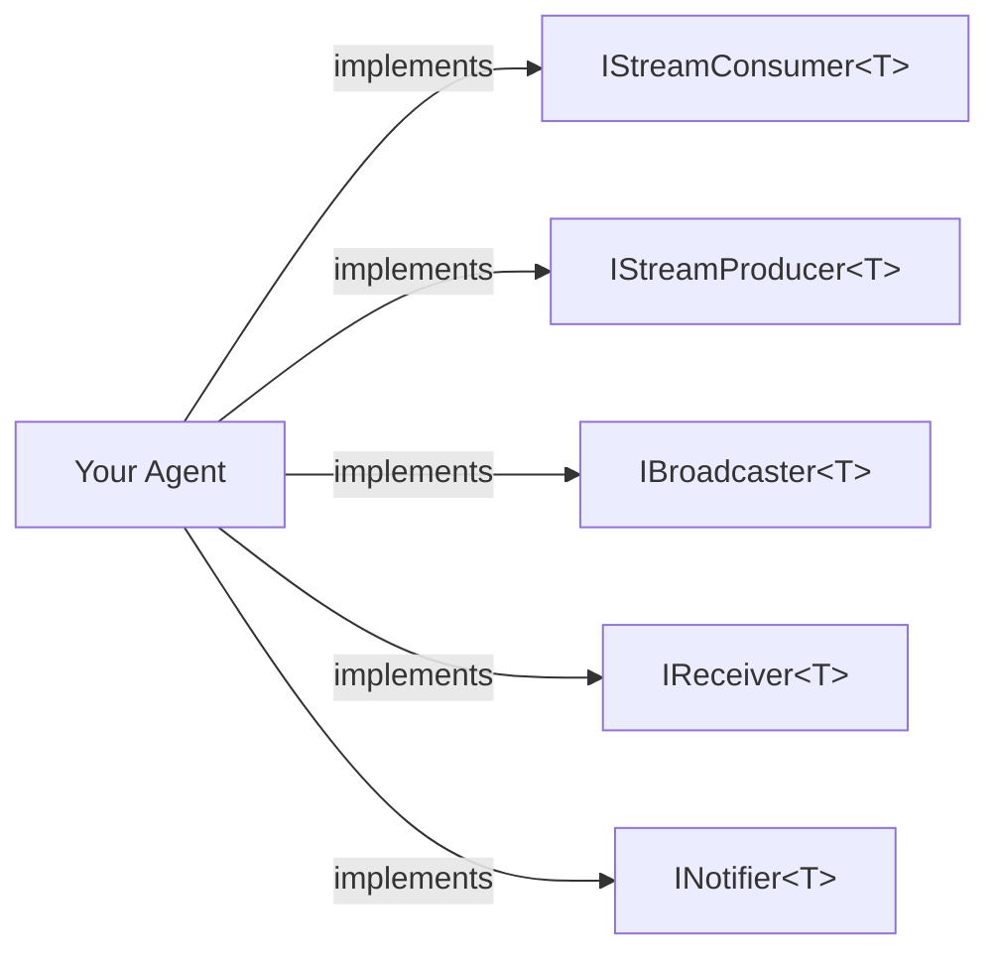
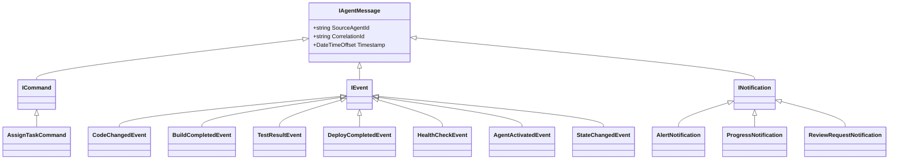
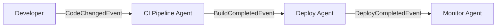
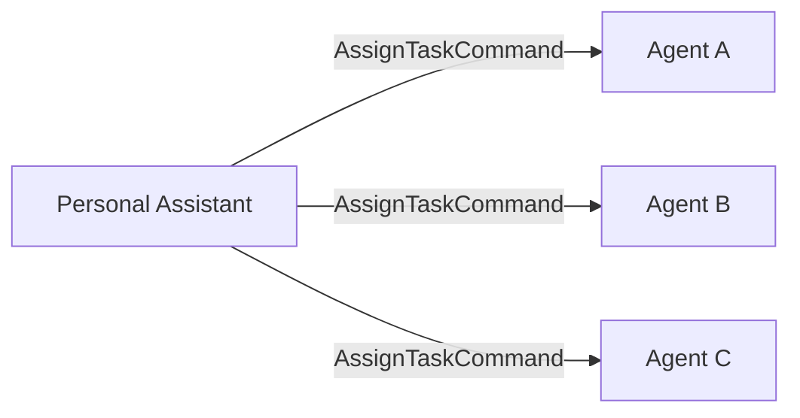
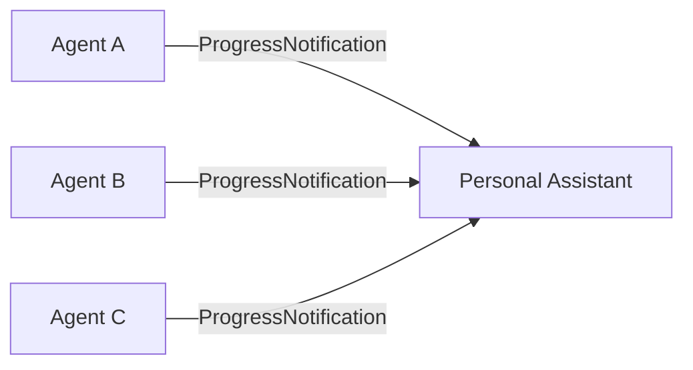

# Architecture

This page covers the V3 agent class hierarchy, behavior composition via interfaces, the typed message system, stream patterns, and the agent registry.

## Class Hierarchy

```
DurableGrain (Orleans.Journaling)
  +-- Agent (Core.V3) [abstract, partial]
        implements IAgent
        implements IRemindable
        implements ISelfDiagnosable

  Partial files:
    Agent.cs          -- Conversation (GetResponse, GetResponseStream, history)
    Agent.Events.cs   -- Event publishing (PublishAsync, PublishTypedAsync)
    Agent.Streams.cs  -- Stream subscriptions (IStreamConsumer auto-wiring)
    Agent.Tools.cs    -- Tool registration (built-in + DefineTools)
    Agent.Tracking.cs -- Tracking items (StartTrackingAsync, OnTrackingDueAsync)
    Agent.State.cs    -- Workspace and state management
    Agent.Lifecycle.cs -- Metadata, capabilities, cancellation
    Agent.Observers.cs -- Observer subscribe/unsubscribe
```

`Agent` is split across 8 partial files for maintainability. Each file owns a single concern.

## Durable State

The `Agent` constructor accepts five durable state collections. Orleans injects and persists these automatically via journaled grain storage:

| Parameter | Type | Storage Key | Purpose |
|---|---|---|---|
| `state` | `IDurableDictionary<string, StateEntry>` | `agent-state` | General key-value state (workspace path, custom data) |
| `eventLog` | `IDurableList<AgentEvent>` | `agent-events` | Immutable event audit log |
| `chatClient` | `IChatClient` | -- | LLM client (not state, injected via DI) |
| `history` | `IDurableList<ChatMessage>` | `v3-history` | Conversation history (role, content, timestamp) |
| `trackingItems` | `IDurableDictionary<string, TrackingItem>` | `v3-tracking` | Scheduled tracking items |

All collections survive grain deactivation and silo restarts. Mutations are committed via `WriteStateAsync()`.

## Behavior Composition

V3 agents compose behaviors by implementing typed interfaces instead of inheriting from deep class hierarchies.



| Interface | Purpose | Auto-wired? |
|---|---|---|
| `IStreamConsumer<TEvent>` | Receive events from a stream | Yes -- auto-subscribes on activation |
| `IStreamProducer<TEvent>` | Publish typed events to a stream | No -- call `PublishTypedAsync` |
| `IBroadcaster<TMessage>` | Fan-out messages to registered receivers | No -- manage receivers, call `BroadcastAsync` |
| `IReceiver<TMessage>` | Accept directed messages from other agents | No -- implement `ReceiveAsync` |
| `INotifier<TNotification>` | Push notifications to observers | No -- manage observers, call `NotifyAsync` |

An agent can implement any combination of these interfaces for different message types.

## Typed Message Hierarchy

All inter-agent messages implement `IAgentMessage`:



| Category | Interface | Use For |
|---|---|---|
| Commands | `ICommand` | Directed requests to a specific agent |
| Events | `IEvent` | Broadcast via Orleans streams |
| Notifications | `INotification` | Observer-pattern delivery |

## Stream Patterns

### Pipeline

Events flow through a chain of agents, each consuming one event type and producing another.



Each agent implements `IStreamConsumer<TInput>` and `IStreamProducer<TOutput>`:

```csharp
public class CIPipelineAgent : Agent,
    IStreamConsumer<CodeChangedEvent>,
    IStreamProducer<BuildCompletedEvent>
{
    // OnStreamEventAsync receives CodeChangedEvent
    // PublishTypedAsync sends BuildCompletedEvent
}
```

### Fan-Out (Broadcast)

One agent broadcasts a message to multiple registered receivers.



The broadcaster implements `IBroadcaster<T>` and manages a list of receivers:

```csharp
public class PersonalAssistantAgent : Agent,
    IBroadcaster<AssignTaskCommand>
{
    // BroadcastAsync sends to all registered receivers
    // RegisterReceiverAsync/UnregisterReceiverAsync manage the list
}
```

### Fan-In (Aggregation)

One agent receives messages from multiple sources via `IReceiver<T>`:



### Stream Name Resolution

Typed events are mapped to Orleans stream names by stripping the suffix and converting to dot.case:

| Type Name | Stream Name |
|---|---|
| `CodeChangedEvent` | `code.changed` |
| `BuildCompletedEvent` | `build.completed` |
| `AssignTaskCommand` | `assign.task` |
| `AlertNotification` | `alert` |

The conversion is handled by `Agent.EventTypeToStreamName()`.

## AI Integration

V3 uses `Microsoft.Extensions.AI` for LLM abstraction and `Microsoft.Agents.AI` for the agent framework.

On activation, the `Agent` base class:
1. Creates an `AIAgent` from the `IChatClient`
2. Configures it with `Instructions` as the system prompt
3. Registers all tools (built-in + custom from `DefineTools()`)
4. Attaches a `DurableChatHistoryProvider` backed by the durable `history` list
5. Creates a session for conversation continuity

`GetResponse` and `GetResponseStream` delegate to the `AIAgent`, which manages tool calling loops, history management, and response generation.

## Tools System

Every agent gets four built-in tool classes:

| Class | Tools | Requires Workspace |
|---|---|---|
| `WorkspaceTools` | `SetWorkspace`, `GetWorkspace` | No |
| `FileTools` | `ReadFileAsync`, `WriteFileAsync`, `ListFiles`, `SearchCode` | Yes |
| `ShellTools` | `RunDotnetAsync`, `RunShellAsync` | Yes |
| `WebTools` | `FetchUrlAsync` | No |

`FileTools` and `ShellTools` are only registered when a workspace path is set. `WebTools` blocks requests to localhost and private IPs (SSRF protection).

Custom tools are added by overriding `DefineTools()`.

## Agent Registry

`AgentRegistrationStartupTask` runs as an Orleans `IStartupTask`. It scans all loaded assemblies for concrete `Agent` subclasses and registers each one in the `AgentRegistryGrain`:

```csharp
var registry = grainFactory.GetGrain<IAgentRegistryGrain>("global");
var allAgents = await registry.GetAllAsync();
var matches = await registry.QueryAsync(new AgentQuery(
    Capabilities: ["code-review"],
    Subscribes: ["CodeChangedEvent"]
));
```

Each `AgentRegistration` includes the agent type name, display name, kind (Static/Dynamic), capabilities, published event types, and subscribed event types.

## Observability

The `AgentTelemetry` class provides built-in telemetry under the `"IAW"` source:

- **ActivitySource**: `"IAW"` -- traces for `agent.activate`, `agent.publish`, `agent.publish_typed`, `agent.handle_stream_event`
- **Counters**: `agents.events.published`, `agents.events.handled`, `agents.activations`, `agents.messages.sent`, `agents.conversations.errors`
- **Histograms**: `agents.events.handle_duration`, `agents.conversations.duration`

All telemetry integrates with the .NET Aspire dashboard via OpenTelemetry.
