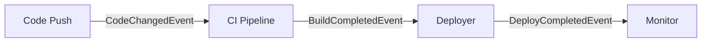
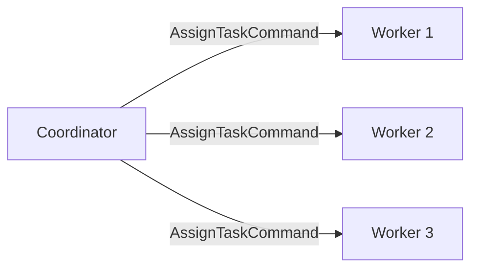
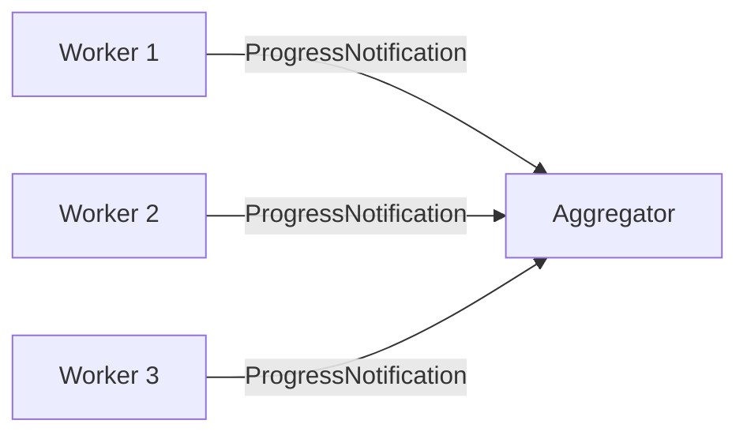

# Events & Streams

V3 agents communicate through typed events and Orleans streams. This page covers event publishing, stream composition interfaces, auto-subscription, and the three stream patterns.

## Event Publishing

Every agent can publish events. Events are recorded in the durable event log and broadcast on Orleans streams.

### Untyped Events

Use `PublishAsync` for simple event publishing with a name and optional payload:

```csharp
await PublishAsync("task.completed", new Dictionary<string, object>
{
    ["taskId"] = "abc",
    ["duration"] = 42
}, ct);
```

This creates an `AgentEvent` record, appends it to the durable event log, and publishes it to the Orleans stream at `StreamId.Create("agents", "task.completed")`.

### Typed Events

Use `PublishTypedAsync` for compile-time-safe event publishing with `IEvent` implementations:

```csharp
await PublishTypedAsync(new CodeChangedEvent(
    SourceAgentId: this.GetPrimaryKeyString(),
    CorrelationId: Guid.NewGuid().ToString(),
    Timestamp: DateTimeOffset.UtcNow,
    FilePaths: ["src/Agent.cs", "src/Tools.cs"],
    CommitSha: "abc123"), ct);
```

The stream name is derived automatically from the type name: `CodeChangedEvent` becomes `code.changed`.

### HandleEvent

Override `HandleEventAsync` to process incoming events:

```csharp
public override async Task HandleEventAsync(AgentEvent agentEvent, CancellationToken ct)
{
    if (agentEvent.EventName == "code.changed")
    {
        await GetResponse($"Review changes from {agentEvent.SourceAgentId}", ct);
    }
}
```

### Event Log

Query the durable event log:

```csharp
var events = await agent.GetEventLogAsync(ct);
foreach (var evt in events)
{
    Console.WriteLine($"{evt.Timestamp}: {evt.EventName} from {evt.SourceAgentId}");
}
```

## Stream Composition Interfaces

V3 provides five interfaces for composing stream behaviors. Each is generic over a message type.

### IStreamConsumer&lt;TEvent&gt;

Auto-subscribes to an Orleans stream on grain activation. When an event arrives, `OnStreamEventAsync` is called:

```csharp
using Core.V3.Communication;
using Core.V3.Messages;
using Orleans.Streams;

public class ReviewAgent : Agent, IStreamConsumer<CodeChangedEvent>
{
    public async Task OnStreamEventAsync(CodeChangedEvent evt, StreamSequenceToken? token)
    {
        var files = string.Join(", ", evt.FilePaths);
        await GetResponse($"Review: {files}. Commit: {evt.CommitSha}", AgentCancellation);
    }
}
```

::: tip
`IStreamConsumer<T>` auto-subscribes during `OnActivateAsync`. You don't need to manually subscribe to streams.
:::

### IStreamProducer&lt;TEvent&gt;

Declares that an agent can publish a specific typed event. Implement `PublishToStreamAsync` and delegate to `PublishTypedAsync`:

```csharp
public class BuildAgent : Agent, IStreamProducer<BuildCompletedEvent>
{
    public async Task PublishToStreamAsync(BuildCompletedEvent evt, CancellationToken ct)
    {
        await PublishTypedAsync(evt, ct);
    }
}
```

### IBroadcaster&lt;TMessage&gt;

Fan-out a message to all registered receivers:

```csharp
public class CoordinatorAgent : Agent, IBroadcaster<AssignTaskCommand>
{
    private readonly HashSet<string> _receivers = [];

    public async Task<BroadcastResult> BroadcastAsync(AssignTaskCommand message, CancellationToken ct)
    {
        var delivered = 0;
        var failed = new List<string>();
        foreach (var id in _receivers)
        {
            try
            {
                var agent = GrainFactory.GetGrain<IAgent>(id);
                await agent.GetResponse($"Task: {message.Description}", ct);
                delivered++;
            }
            catch { failed.Add(id); }
        }
        return new BroadcastResult(_receivers.Count, delivered, failed.Count, [.. failed]);
    }

    public Task RegisterReceiverAsync(string receiverId)
    {
        _receivers.Add(receiverId);
        return Task.CompletedTask;
    }

    public Task UnregisterReceiverAsync(string receiverId)
    {
        _receivers.Remove(receiverId);
        return Task.CompletedTask;
    }

    public Task<IReadOnlyList<string>> GetReceiversAsync()
        => Task.FromResult<IReadOnlyList<string>>([.. _receivers]);
}
```

### IReceiver&lt;TMessage&gt;

Accept directed messages from other agents:

```csharp
public class WorkerAgent : Agent, IReceiver<AssignTaskCommand>
{
    public async Task<MessageReceipt> ReceiveAsync(AssignTaskCommand cmd, CancellationToken ct)
    {
        var result = await GetResponse($"Execute task: {cmd.Description}", ct);
        return new MessageReceipt(true, this.GetPrimaryKeyString(), DateTimeOffset.UtcNow, null);
    }

    public Task<bool> CanReceiveAsync(CancellationToken ct) => Task.FromResult(true);
}
```

The `MessageReceipt` provides delivery acknowledgment:

```csharp
public record MessageReceipt(
    bool Accepted,
    string ReceiptId,
    DateTimeOffset Timestamp,
    string? RejectionReason);
```

### INotifier&lt;TNotification&gt;

Push notifications to subscribed observers using the Orleans observer pattern:

```csharp
public class MonitorAgent : Agent, INotifier<AlertNotification>
{
    public async Task NotifyAsync(AlertNotification notification, CancellationToken ct)
    {
        // Push to all subscribed observers
    }

    public Task SubscribeObserverAsync(IAgentObserver<AlertNotification> observer) { ... }
    public Task UnsubscribeObserverAsync(IAgentObserver<AlertNotification> observer) { ... }
}
```

## Stream Name Resolution

Type names are converted to stream names by:
1. Stripping the suffix (`Event`, `Command`, or `Notification`)
2. Converting PascalCase to dot.case

| Type | Stream Name |
|---|---|
| `CodeChangedEvent` | `code.changed` |
| `BuildCompletedEvent` | `build.completed` |
| `AssignTaskCommand` | `assign.task` |
| `AlertNotification` | `alert` |
| `HealthCheckEvent` | `health.check` |

## Stream Patterns

### Pipeline Pattern

Chain agents where each consumes one event type and produces another:



```csharp
public class CIPipelineAgent : Agent,
    IStreamConsumer<CodeChangedEvent>,
    IStreamProducer<BuildCompletedEvent>
{
    public async Task OnStreamEventAsync(CodeChangedEvent evt, StreamSequenceToken? token)
    {
        var result = await GetResponse(
            $"Build and test: {string.Join(", ", evt.FilePaths)}", AgentCancellation);
        var success = !result.Contains("error", StringComparison.OrdinalIgnoreCase);

        await PublishToStreamAsync(new BuildCompletedEvent(
            this.GetPrimaryKeyString(), evt.CorrelationId, DateTimeOffset.UtcNow,
            success, evt.CommitSha, result), AgentCancellation);
    }

    public async Task PublishToStreamAsync(BuildCompletedEvent evt, CancellationToken ct)
        => await PublishTypedAsync(evt, ct);
}
```

### Fan-Out Pattern

One agent broadcasts to many receivers:



Use `IBroadcaster<T>` with `RegisterReceiverAsync` to manage the receiver list, then call `BroadcastAsync`.

### Fan-In Pattern

Multiple agents report to one aggregator:



The aggregator implements `IReceiver<ProgressNotification>` and collects results from multiple sources.

## Active Subscriptions

Query which streams an agent is subscribed to:

```csharp
var subs = await agent.GetActiveSubscriptionsAsync(ct);
// Returns: ["code.changed", "build.completed", ...]
```

This is determined by scanning the agent's `IStreamConsumer<T>` interfaces at runtime.
